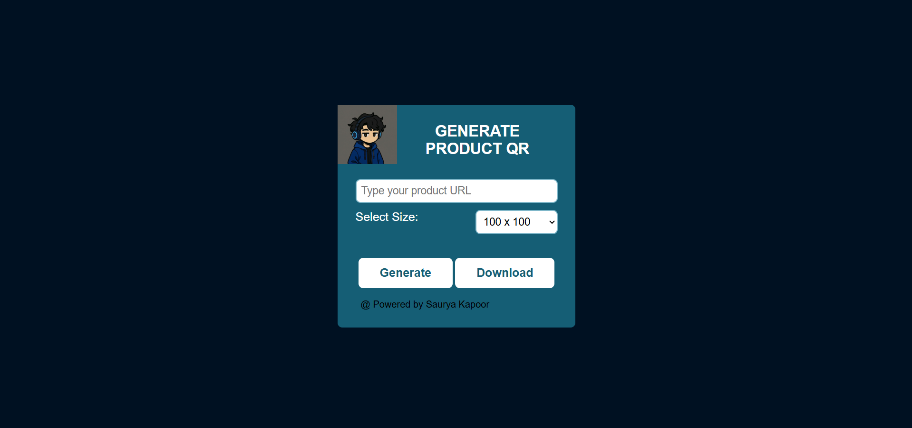

# 🔳 QR Code Generator by TeamSukun

<p align="center">
  
</p>


<p align="center">
    <a href="https://github.com/sauryakapoor15/Qr-code-generator"> </a>
    <a href="https://github.com/sauryakapoor15/Qr-code-generator/commits/aksr-aashish"> </a>
    <a href="https://github.com/sauryakapoor15/Qr-code-generator/issues"> </a>
    <a href="https://github.com/sauryakapoor15/Qr-code-generator/network/members"> </a> 
  
</p>

---

## 🔍 Overview

**QR Code Generator** is a clean, responsive, and interactive web app that allows users to:
- 🔗 Enter any text or URL
- 📐 Choose a QR code size (100x100 to 1000x1000)
- 🖼️ Instantly generate the QR code
- 💾 Download the generated QR image

It is built using **HTML, CSS, and JavaScript** with zero frameworks and only one lightweight QR generation library.

---

## 🎯 Features

- ✅ Live QR generation on input + size change
- 📏 Size options from 100px to 1000px
- 📥 One-click image download (PNG format)
- 📱 Fully responsive layout
- 🎨 Modern and minimal UI with custom CSS
- ⚡ Fast, lightweight, and easy to use

---

## 🧠 Technical Stack

| Technology       | Description                                  |
|------------------|----------------------------------------------|
| **HTML5**        | Structure and layout of the web app          |
| **CSS3**         | Styling, layout, and responsiveness          |
| **Vanilla JavaScript** | Logic for input handling and QR rendering |
| **QRCode.js**    | External library used to generate QR codes   |
| **Canvas API**   | Used for QR code rendering and export        |
| **GitHub Pages** _(optional)_ | Hosting for live demo          |

---

## 📂 Project Structure
<br>
    &nbsp  📁 QR-Code-Generator/<br>
    &nbsp  ├── qr.html # Main HTML structure<br>
   &nbsp   ├── qr-style.css # Styling and layout<br>
    &nbsp  ├── qr-script.js # JavaScript logic and functionality<br>
    &nbsp  ├── images/ # logos <br>
   &nbsp   └── assets/ # Screenshots or demo files<br>

 ## 📸 Screenshot

> _Responsive & minimal interface with live QR rendering and download option:_

 <!-- Replace this with your actual image path -->

---

## 🚀 Getting Started

### 1. Clone the repository

```bash
git clone https://github.com/sauryakapoor15/QR-Code-Generator.git
cd QR-Code-Generator
```

## 🙌 Credits
<details> <summary><strong>👨‍💻 Creator</strong></summary>
Name: Saurya Kapoor<br>
Role: Frontend Developer | Bot Developer<br>
Skills: HTML, CSS, JavaScript, Python<br>
LinkedIn: linkedin.com/in/saurya11253v<br>
GitHub: @sauryakapoor15<br>

</details> <details> <summary><strong>📦 Libraries & Resources</strong></summary>
QRCode.js – For generating QR codes

Vanilla JavaScript & CSS3 – For logic and styling

</details>
